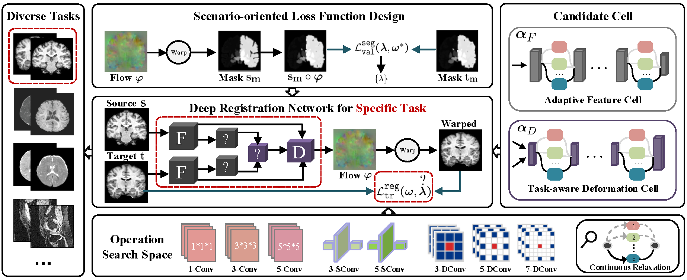

# AutoReg

The code is still being sorted......

This is the official code for "Jointly Optimizing Architecture and Training Objective for Medical Image Registration" \\
Conventional registration methods optimize an objective function independently for each pair of images, time-consuming for large data.
Recent learning-based methods render fast registration by leveraging deep networks to directly learn the spatial transformation fields between the source and target images. 
However, it needs intensive labor and extensive experience to manually design the network architecture and tuning training objectives for multiple types of medical data.
To tackle the aforementioned problems, this paper proposes an automated registration learning framework that searches both architectures and their corresponding training objectives, friendly to users for medical image analysis.

We establish a triple-level framework to deduce registration network architectures and objectives with an auto-searching mechanism and cooperating optimization.

